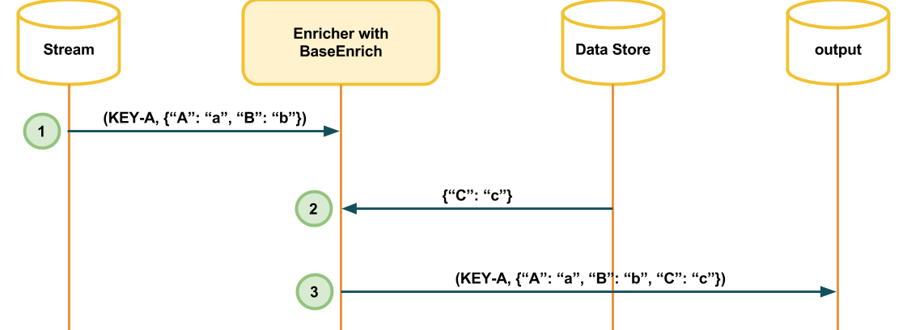

The Base Enrich is a simple enricher that complements the information of received messages.

The enrichment system can be either SQL or NoSQL database, a CSV file or any other data store system.

Image above represents the base enrich behaviour:

1. Enricher receives a message from `stream` topic.
2. Enricher enrich the received message with a external data store system.
3. Enricher sends the enrich message to `output` topic.

It important to emphasise that a message doesn't need to have a key like the joiners.