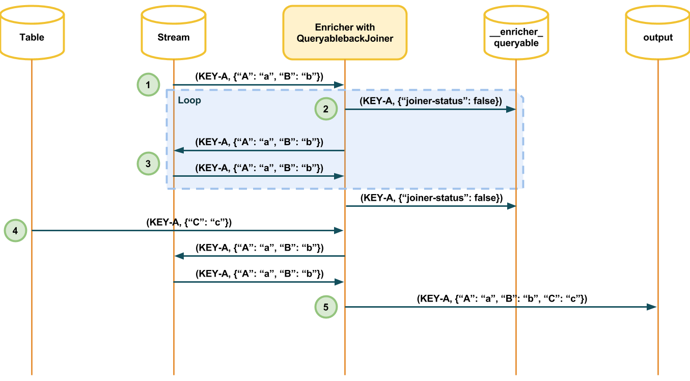

The queryableback joiner work like base joiner. The difference is that a queryableback joiner will notify to `__enricher_queryable` and will resend message to stream, if received message cannot be join it with other message with same key.



Image above represents the queryableback join behaviour:
 
1. Enricher receives a message from `stream` topic. 
2. As there is no any message from `table` topic, so enricher sends next notification to `__enricher_queryable` topic:

  ```
     (
       KEY-A,	
       {
         "joiner":"joinerStream",
         "type":"joiner-query",
         "table":"metrics",
         "joiner-status":false
       }
     )
  ```
3. Enricher resends the message to `stream` topic again.
4. Enricher receives the message from `table` topic.
5. Enricher joins the messages and sends to `output` topic.

Just as base joiner, queryableback joiner have next functions:

|Function|Description|
|--------|-----------|
|StreamPreferredJoiner| Joiner that allows join both two streams of JSON objects, favoring the stream's fields.|
|TablePreferredJoiner| Joiner that allows join both two streams of JSON objects, favoring the tables's fields.|

#####**_Caution_**

Steps 2 and 3 is a loop, if message isn't joined then they will be resend forever.